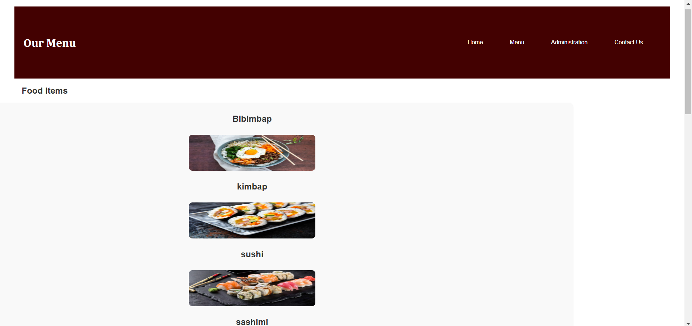
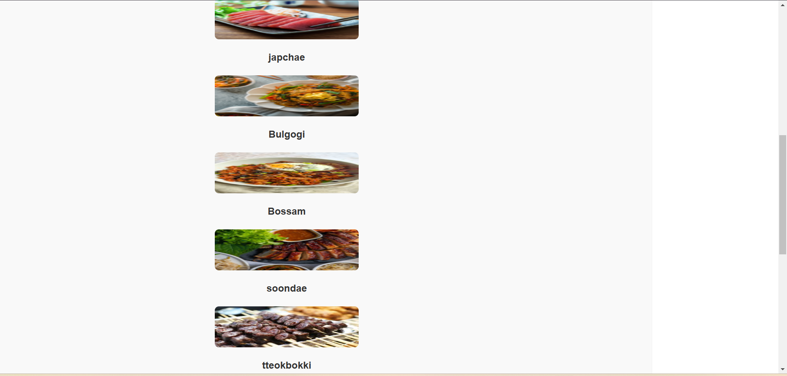
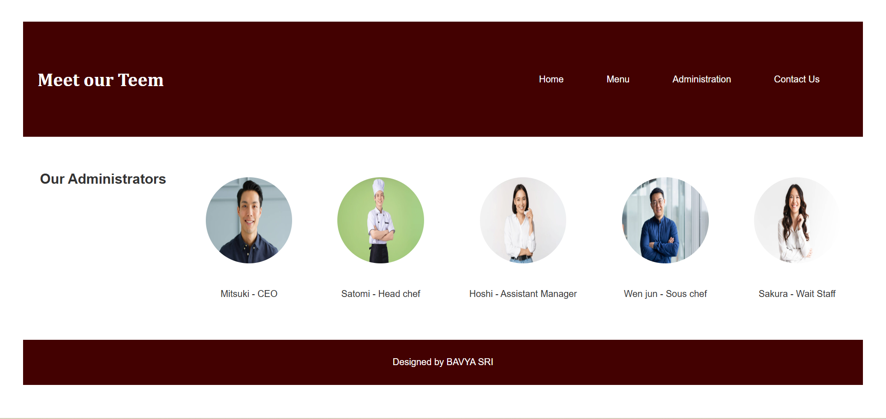
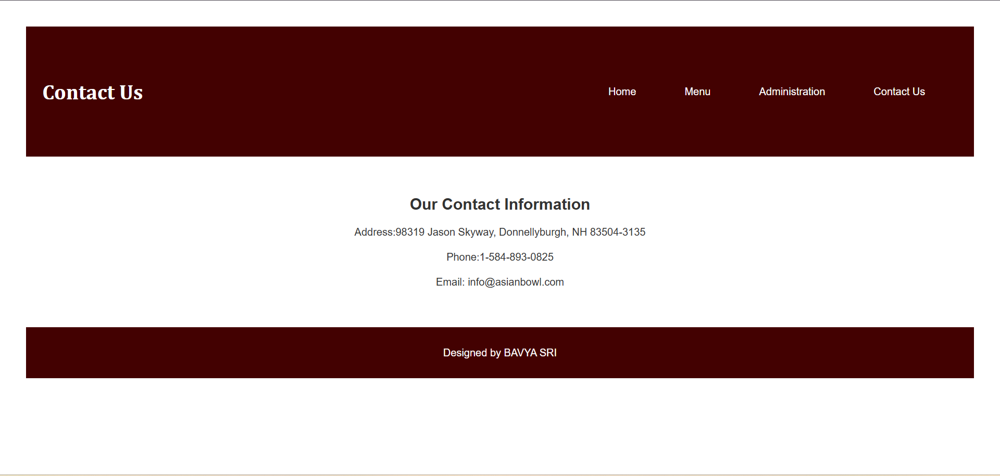

# Ex.07 Restaurant Website
# Date: 08.11.2024
# AIM:
To develop a static Restaurant website to display the food items and services provided by them.

# DESIGN STEPS:
## Step 1:
Requirement collection.

## Step 2:
Creating the layout using HTML and CSS.

## Step 3:
Updating the sample content.

## Step 4:
Choose the appropriate style and color scheme.

## Step 5:
Validate the layout in various browsers.

## Step 6:
Validate the HTML code.

## Step 7:
Publish the website in the given URL.

# PROGRAM:
```
restaurant-website.html

<!DOCTYPE html>
<html lang="en">
<head>
    <meta charset="UTF-8">
    <meta name="viewport" content="width=device-width, initial-scale=1.0">
    <title>ASIAN BOWL</title>
    <link rel="stylesheet" href="styles.css">
</head>
<body>
    <header>
        <div class="header-container">
            
            <h1>      ASIAN WOK</h1>
        </div>
        <nav>
        <ul>
            <li><a href="restaurant-website.html">Home</a></li>
            <li><a href="menu.html">Menu</a></li>
            <li><a href="administration.html">Administration</a></li>
            <li><a href="contact.html">Contact Us</a></li>
        </ul>
        </nav>
    </header>
    <section class="banner">
        <h2>Welcome To Asian Wok Restaurant</h2>
        <h1>30% Off This Weekend </h1>
    
    </section>
    <section class="menu-sectionn">
        <div class="info-box">
            <h2>Our New Menu</h2>
            
            <p>Get a taste of our new menu options </p>
            <a href="menu.html">See our new menu</a>
        </div>
        <div class="info-box">
            <h2>Administration</h2>
            
            <p>Introducing our talented teem</p>
            <a href="administration.html">Administration</a>
        </div>
        <div class="info-box">
            <h2>Opening Hours</h2>
            
            <p>Mon - Fri: 2pm - 10pm</p>
            <p>Sat: 2pm - 11pm</p>
            <p>Sun: 2pm - 9pm</p>
            <a href="contact.html">contact us</a>
        </div>
    </section>
    <footer>
        <p>Designed by [BAVYA SRI]</p>
    </footer>
    
</body>
</html>

menu.html

<!DOCTYPE html>
<html lang="en">
<head>
    <meta charset="UTF-8">
    <meta name="viewport" content="width=device-width, initial-scale=1.0">
    <title>Menu| ASIAN BOWL</title>
    <link rel="stylesheet" href="styles.css">
</head>
<body>
    <header>
        <h1>Our Menu</h1>
        <nav>
            <ul>
                <li><a href="restaurant-website.html">Home</a></li>
                <li><a href="menu.html">Menu</a></li>
                <li><a href="administration.html">Administration</a></li>
                <li><a href="contact.html">Contact Us</a></li>
            </ul>
        </nav>
    </header>
    <div class="menu-sectionn">
        <h2>Food Items</h2>
        <div class="menu-items">
          <h2>Bibimbap</h2>
          
          <h2>kimbap</h2>
          
          <h2>sushi</h3>
          
          <h2>sashimi</h2>
            
          <h2>japchae</h2>
          
          <h2>Bulgogi </h2>
          
          <h2>Bossam</h2>
          
          <h2>soondae</h2>
          
          <h2>tteokbokki</h2>
          
          <h2>hobakjuk</h2>
          
          <h2>Ramen </h2>
          
          <h2>oden</h2>
          
      </div>
    </div>
    <footer>
        <p>Designed by BAVYA SRI</p>
    </footer>
    
</body>
</html>

administration.html

<!DOCTYPE html>
<html lang="en">
<head>
    <meta charset="UTF-8">
    <meta name="viewport" content="width=device-width, initial-scale=1.0">
    <title>Administration | ASIAN BOWL</title>
    <link rel="stylesheet" href="styles.css">
</head>
<body>
    <header>
        <h1> Meet our Teem</h1>
        <nav>
            <ul>
                <li><a href="restaurant-website.html">Home</a></li>
                <li><a href="menu.html">Menu</a></li>
                <li><a href="administration.html">Administration</a></li>
                <li><a href="contact.html">Contact Us</a></li>
            </ul>
        </nav>
    </header>
    <section class="admin-section">
        <h2>Our Administrators</h2>
            <div class="admin-box">
                
                <p>Mitsuki  - CEO</p>
            </div>
            <div class="admin-box">
                
                <p>Satomi - Head chef</p>
            </div>
            <div class="admin-box">
                
                <p>Hoshi -  Assistant Manager</p>
            </div>
            <div class="admin-box">
                
                <p>Wen jun - Sous chef</p>
            </div>
            <div class="admin-box">
                
                <p>Sakura - Wait Staff</p>
            </div>
        
    </section>

    <footer>
        <p>Designed by BAVYA SRI</p>
    </footer>


    
</body>
</html>

contact.html

<!DOCTYPE html>
<html lang="en">
<head>
    <meta charset="UTF-8">
    <meta name="viewport" content="width=device-width, initial-scale=1.0">
    <title>Contact Us - Asian Bowl Restaurant</title>
    <link rel="stylesheet" href="styles.css">
</head>
<body>
    <header>
        <h1>Contact Us</h1>
        <nav>
            <ul>
                <li><a href="restaurant-website.html">Home</a></li>
                <li><a href="menu.html">Menu</a></li>
                <li><a href="administration.html">Administration</a></li>
                <li><a href="contact.html">Contact Us</a></li>
            </ul>
        </nav>
    </header>

    <section class="contact-section">
        <h2>Our Contact Information</h2>
        <p>Address:98319 Jason Skyway, Donnellyburgh, NH 83504-3135</p>
        <p>Phone:1-584-893-0825</p>
        <p>Email: info@asianbowl.com</p>
    </section>

    <footer>
        <p>Designed by BAVYA SRI</p>
    </footer>
</body>
</html>

styles.css

 {
    margin: 20px;
    padding: 0;
    box-sizing: border-box;
    font-family: Arial, sans-serif;
}
h1{
    text-align: center;
    font-family: Cambria, Cochin, Georgia, Times, 'Times New Roman', serif;
}  


body{ 
        font-family: Arial, sans-serif;
        background-color: white;
        color: #333;
        margin: 0;
        padding: 0;
    
}

header {
    display: flex;
    height: 200px;
    justify-content: space-between;
    align-items: center;
    text-align: center;
    padding: 5px;
    background-color:#430101 ;
    color:white;
    
}


.logo {
    display: flex; 
    align-items: center; 
    gap: 40px; 
}

.logo img {
    width: 40px; 
    height: 40px; 
    margin-right: 0; 
}

 nav ul {
    list-style-type:none;
    padding: 0;
}

 nav ul li {
    display: inline;
    margin-right: 10px;
    
    font-family: Arial, Helvetica, sans-serif;
}

nav ul li a {
    color: white;
    text-decoration:none;
    font-family: Arial, Helvetica, sans-serif;
}
.title h1 {
    font-size: 30px;
    font-weight: bold;
    position: relative; top: 60px;
    font-family: Georgia, 'Times New Roman', Times, serif;
}
.logo {
     display: flex;  
    align-items:flex-start;
    height: auto;
    width: 20px;
    position: relative; left: -150x;
    margin-bottom: -55px;
    
}
.banner {
    background-image: url('image\ copy.png');
    background-size:cover;
    background-position: center;
    height: 200px;
    width: 1000 px;
     
    text-align: center;
    padding: 50px ;
    color: white;
    font-size: 30px;
    font-family:'Trebuchet MS', 'Lucida Sans Unicode', 'Lucida Grande', 'Lucida Sans', Arial, sans-serif;
    border-radius: 20px;
}

.banner h2 {
    font-size: 2.5rem;
}

.banner p {
    margin-top: 10px;
    font-size: 1.2rem; 
 }
.menu-section {
    display: flex;
     justify-content: center;
     padding: 20px;

    
}
.menu-image{
    margin-top: 15px;
    width:200px;
    max-width: 50px; 
    height: 150px;
    border-radius: 10px;
    
}


.menu-items{
    position: relative;


}

.menu-section {
    display: flex;
    flex-wrap: nowrap; 
    justify-content: space-around;
    align-items: center; 
    width: 100%; 
    height: 150px;
    gap: 20px; 
}

.info-box {
    background-color: blanchedalmond;
    padding: 20px;
    border-radius: 10px;
    box-shadow: 0 4px 8px rgba(0, 0, 0, 0.1);
    text-align: center;
    width: 30%; 
    
    display: inline-block;
}

  .menu-items { 
    display:flex;
    flex-direction: column; 
     position: relative;left: -250px;
  } 
   
  .admin-image {
    margin-top: 15px;
    width: 50%;
    max-width: 100px;
    height: 100px;
    border-radius: 10px;
      display: flex; 
     justify-content:space-around;
    flex-wrap: wrap;  
}
.working-image{
    margin-top:15px ;
    width: 50%;
    max-width: 100px;
    height: 111px;
    border-radius: 10px;
}
  .menu-section ul{
    list-style-type: none ;
    padding: 0;
  }
  .menu-section ul li {
    margin: 10px 0;
    font-size: 18px;
  }


  .admin-section {
    display: flex;
    flex-wrap: nowrap;
    width: 100%; 
    margin: 10px 0;
    justify-content: space-around; 
    text-align: center;
    padding: 20px;
}

.admin.person img {
    width: 100px;
    height: 100px;
    border-radius: 50%; 
}

.admin-box {
    margin: 10px;
    text-align: center;
}

.admin-box img {
    width: 150px;
    height: 150px;
    border-radius: 50%; 
}

.contact-section{
    text-align: center;
    padding: 20px;
}
.menu-section {
    display: grid;
    grid-template-columns: repeat(1, 1fr); 
    gap: 20px;
    padding: 20px;
    justify-content: center;
    align-items: start;
}

.menu-section h2 {
    text-align: center;
    font-size: 18px;
}

.menu-items img {
    max-width: 20%; 
    max-height: 100px; 
    border-radius: 10px;
    display: block;
    margin: 10px auto; 
}

.menu-items {
    text-align: center;
    background-color: #f9f9f9;
    padding: 10px;
    border-radius: 10px;
    box-shadow: 0 2px 4px rgba(0, 0, 0, 0.1);
}


footer {
    background-color: #430101;
    color: white;
    padding: 10px 0;
    text-align: center;
}
```

# OUTPUT:








# RESULT:
The program for designing software company website using HTML and CSS is completed successfully.
